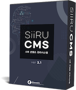

# Home


## SiiRU CMS v2.1

SiiRU CMS\(시루 콘텐츠 관리 시스템\)는 Good Software\(GS\) 인증 및 전자정부표준프레임워크 호환성 인증을 획득한 솔루션으로 홈페이지를 관리하는데 필요한 기능을 통합, 효율적으로 구축할 수 있습니다.


## 바로가기

* [기능 및 특장점](siiru/features.md)
* [설치 가이드](https://docs.comin.com/guide/setup)
* [운영자 매뉴얼](https://siiru.comin.com/SiiRUCMS.v2.1.pdf)

## Get help

* Visit the SDK [community forum](https://forums.adobe.com/community/experience-cloud/platform/launch/sdk) to ask questions
* Contact [Adobe Experience Cloud customer care](https://helpx.adobe.com/contact/enterprise-support.ec.html) for immediate assistance

