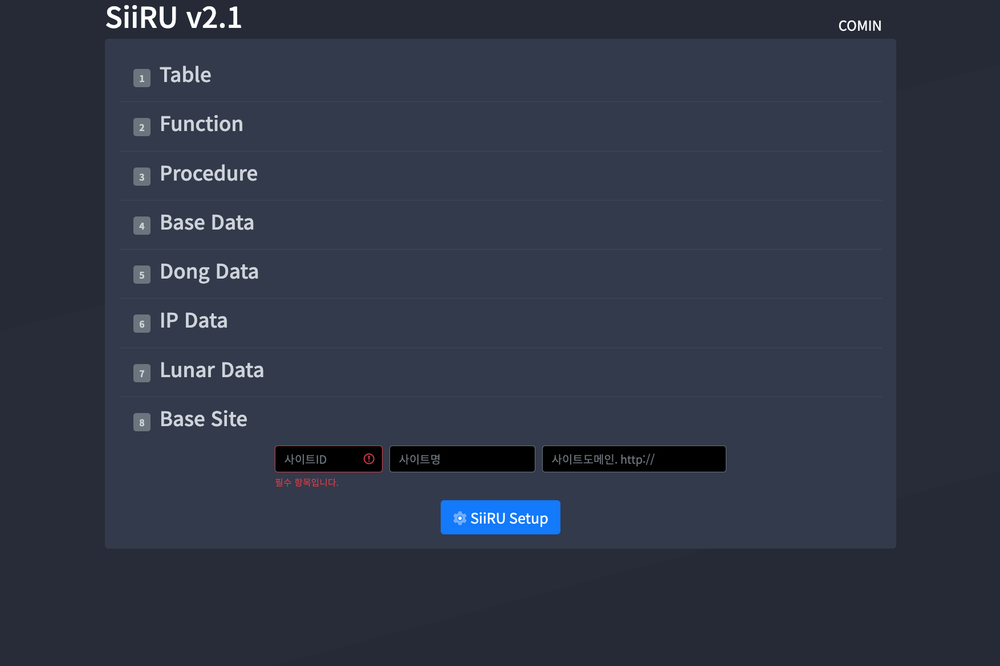

# 설치

> **작성 : \(주\)가민정보시스템 정보기술연구소 프레임웍연구팀**  
> TEL : 062-653-2879 \| 직통 : 070-4827-4930

#### 📁 Revision History

| **개정일자** | 내용 | 작성자 | 승인/검토자 |
| :--- | :--- | :--- | :--- |
| 2021.03.15. | Initial Draft | 장누가 선임 | 허창선 수석 |
| 2021.05.10. | Update Domain | 장누가 선임 | 허창선 수석 |


## 설치 환경

본 시스템은 아래와 같은 환경에서 설치 및 운영 테스트함.

* OS : CentOS 7.0 이상
* Database : MariaDB 10.2.x / MySQL 8.0.x / Oracle 11G / Tibero 5.x, 6.x
* JDK : 1.8.0 이상
* WEB : Apache 2.2.x 이상
* WAS : Apache Tomcat 8.x, Tmax Jeus 7


## 설치 방법

### 설치 파일 업로드

SiiRU CMS의 소스 파일을 서버에 업로드 및 압축 해제한다.

1. SiiRU CMS 소스를 업로드할 계정을 생성한다.

   `useradd [계정명]`

2. SiiRU CMS 소스 파일을 업로드 후 사용자 홈 폴더 아래에 압축을 해제한다.

   `tar zxvf SiiRU_v2.1.tar.gz /home/[계정명]/public_html`

### Apache 설정

SiiRU CMS를 운영하기 위한 서버에 Apache가 설치되어 있고, 이를 사용하는 경우 아래와 같이 설정한다.

#### 1. Tomcat Connector 설치

1. Tomcat Connectors JK 최신 버전을 다운로드한다.

   : [https://tomcat.apache.org/download-connectors.cgi](https://tomcat.apache.org/download-connectors.cgi)

2. 컴파일 설치를 위한 기본 모듈을 확인하고 설치한다.

   `yum install autoconf libtool`

   `which apxs` → apxs 모듈 설치 경로 확인

3. 다운로드 받은 파일을 서버에 업로드하고 특정 경로에 해당 파일의 압축을 해제한다.

   `tar zxvf tomcat-connectors-1.2.48-src.tar.gz [압축 해제할 경로]`

4. 해당 디렉토리 아래 native 폴더로 이동 후 configure를 아래와 같이 진행한다.

   `cd [압축 해제된 경로]/tomcat-connector-1.2.48-src/native` `./configure --with-apxs=[2에서 확인한 apxs 모듈 경로]`

5. 설치 파일 생성 및 설치

   `make && make install`

6. 설치 확인

   `find / -name 'mod_jk.so'`

#### 2. Apache 환경설정 수정

* Apache 설정 파일 httpd.conf에서 아래 내용을 수정 및 추가한다.
* `vi [Apache 설치 경로]/conf/httpd.conf`

  ```bash
    ServerTokens prod
    ServerSignature Off

    Timeout 300

    <Directory />
        Require all granted
    </Directory>

    LoadModule jk_module modules/mod_jk.so

    <IfModule jk_module>
      JkWorkersFile "conf/workers.properties"
      JkLogFile "logs/mod_jk.log"
      JkLogLevel info
      JkShmFile run/mod_jk.shm
      #JkMountFile conf/uriworkermap.properties
      JkLogStampFormat "[%a %b %d %H:%M:%S %Y] "
        JkRequestLogFormat "%w %V %T"
    </IfModule>
  ```

#### 3. Tomcat 연동 및 가상 호스트 추가

1. Apache 환경 설정 폴더 아래에 workers.properties를 생성 및 아래 내용을 추가한다.
2. `vi [Apache 설치 경로]/conf/workeres.properties`

   ```bash
     ################################################
     #Definition for Ajp13 worker
     ################################################
     worker.list=서비스명

     worker.서비스명.port=8080 # 톰캣_서비스_포트
     worker.서비스명.host=localhost # 톰캣_서비스_호스트주소
     worker.서비스명.type=ajp13
     worker.서비스명.lbfactor=1
   ```

3. Apache 가상 호스트 설정 파일 httpd-vhosts.conf에서 아래 내용을 추가한다.
4. `vi [Apache 설치 경로]/conf.d/httpd-vhosts.conf` 또는 `vi [Apache 설치 경로]/conf/extra/httpd-vhosts.conf`

   ```bash
     <VirtualHost *:80>
         ServerAdmin webmaster@test.com
         ServerName test.com
         ServerAlias www.test.com
         DocumentRoot "/home/test/public_html"
         DirectoryIndex index.jsp index.html

         ErrorLog "|/usr/sbin/rotatelogs [Apache 설치 경로]/logs/test_error_log_%Y%m%d 86400"
         CustomLog "|/usr/sbin/rotatelogs [Apache 설치 경로]/logs/test_access_log_%Y%m%d 86400" combined env=!do_not_log

         JkLogFile logs/mod_jk.log
         JkLogLevel info
         JkLogStampFormat "[%a %b %d %H:%M:%S %Y] "
         JkMount /* 서비스명  # workers.properties에서 지정해준 list명
     </VirtualHost>
   ```

5. Apache 서비스를 테스트 및 재기동한다.

   `[Apache 설치 경로]/bin/apachectl configtest 또는 httpd -t` → `Syntax OK`

   `[Apache 설치 경로]/bin/apachectl restart`

### Tomcat 설정

SiiRU CMS를 운영하기 위한 WAS 서버에 Apache Tomcat을 사용하는 경우 아래와 같이 설정한다.

#### 1. JDK 설치 확인

* SiiRU CMS v2.1은 OpenJDK/OracleJDK 1.8.0 이상을 사용 권장한다.
* 설치된 JDK의 위치 확인 : `which java`
* 설치된 JDK의 버전 확인 : `java -version`

#### 2. Tomcat 설치

* SiiRU CMS v2.1은 JDK 1.8.0 이상이 설치된 환경에서 Apache Tomcat 8.5.51 이상을 사용 권장한다.
* Tomcat 버전 확인 : `sh [Tomcat 설치 경로]/bin/version.sh`
* Apache Tomcat 8.5.51 이상 버전을 다운로드한다.

  : [https://archive.apache.org/dist/tomcat/tomcat-8/](https://archive.apache.org/dist/tomcat/tomcat-8/)

  : 버전 선택 → bin 폴더 → apache-tomcat-8.5.x.tar.gz 파일 다운로드

* 다운로드 받은 파일을 서버에 업로드하고 특정 경로에 해당 파일의 압축을 해제한다.

  `tar zxvf apache-tomcat-8.5.x.tar.gz [압축 해제할 경로]`

* 해당 디렉토리로 이동하여 서비스 기동을 확인한다.

  `cd [압축 해제된 경로]/bin` → `sh ./startup.sh`

  * 프로세스 확인 : `ps -ef | grep java | grep [Tomcat 설치 경로]`
  * 서비스 포트 확인 : `netstat -an | grep "LISTEN " | grep 8080`

#### 3. 환경 설정

* Tomcat이 설치된 디렉토리 하위의 각 파일을 열어 아래 내용을 서버 환경에 맞게 추가 및 수정한다.
* `vi [Tomcat 설치 경로]/conf/server.xml`
  * 서비스할 사이트 환경에 맞추어 와  하위의 내용을 수정한다.
  * 서브디렉토리 방식의 도메인을 사용할 경우 의 path를 수정한다. \(예\) www.domain.com/test인 경우 path="/test"

    ```bash
      <Service name="Catalina">
         <Connector port="8080" protocol="AJP/1.3" address="0.0.0.0" redirectPort="8443" URIEncoding="UTF-8" maxThreads="250" maxHttpHeaderSize="8192" emptySessionPath="true" enableLookups="false" acceptCount="100" disableUploadTimeout="true" maxPostSize="-1" maxParameterCount="-1" maxSwallowSize="-1" connectionTimeout="20000" secretRequired="false" server="server" />
          <Engine name="Catalina" defaultHost="localhost">
            <Realm className="org.apache.catalina.realm.LockOutRealm">
              <Realm className="org.apache.catalina.realm.UserDatabaseRealm" resourceName="UserDatabase"/>
            </Realm>
            <Host name="localhost" appBase="/home/계정명" unpackWARs="true" autoDeploy="true" xmlValidation="false" xmlNamespaceAware="false">
              <Context docBase="public_html" path="/" reloadable="true">
                      <CookieProcessor sameSiteCookies="none" />
                  </Context>
            </Host>
          </Engine>
      </Service>
    ```
* `vi [Tomcat 설치 경로]/conf/web.xml`
  * http로 접근할 경우 의 항목을 false, https로 접근할 경우 true로 설정해주어야 한다.

    ```bash
      <session-config>
      <session-timeout>3600</session-timeout>
          <cookie-config>
              <http-only>true</http-only>
              <secure>true</secure>
          </cookie-config>
      </session-config>
    ```
* `vi [Tomcat 설치 경로]/bin/catalina.sh`

  ```bash
    ## JVM Option
    JAVA_OPTS="-Djava.awt.headless=true -Dfile.encoding=UTF-8 -server -Xms4096M -Xmx4096M -XX:NewSize=1024M -XX:MaxNewSize=1024M -XX:PermSize=256M -XX:MaxPermSize=256M -XX:+DisableExplicitGC"
  ```

  * JVM 메모리 설정 1. `catalina.sh` 상단에 위와 같은 JAVA\_OPTS 구문을 추가하여 JVM 메모리를 설정할 수 있다. 2. JVM 메모리 관련 옵션 정보는 아래와 같다.
    * -Xms : Java Heap 영역의 최소 Size
    * -Xmx : Java Heap 영역의 Size
    * -XX:NewSize : New Generation의 최소 Size
    * -XX:MaxNewSize : New Generation의 최대 Size
    * -XX:PermSize : Permananet 영역의 최소 Size
    * -XX:MaxPermSize : Permananet 영역의 최대 Size
    * 각 최소/최대 사이즈는 부하가 늘어날 때 메모리를 증가시키는 작업 자체가 새로운 부하가 될 수 있으므로, 최소/최대 사이즈를 동일하게 설정하여 메모리를 확보한 상태에서 JVM을 가동시키는 것이 좋다. 3. 서버에 필요한 메모리 계산 방법은 다음과 같다.

      \(MaxProcessMemory - JVMMemory - ReservedOsMemory\) / \(ThreadStackSize\) = Number of threads
  * 일자별 로그 설정 시 \(catalina.sh의 450~480 Line\) 1. `# touch "$CATALINA_OUT"` 구문을 주석 처리 2. Apache 가 설치되어 있지 않은 경우에는 `>> "$CATALINA_OUT" 2>&1 "&"` 구문을 `>> "$CATALINA_OUT".$(date '+%Y-%m-%d') 2>&1 "&"` 로 수정 3. Apache 가 설치되어 있는 경우에는 `>> "$CATALINA_OUT" 2>&1 "&"` 구문을 `2>&1 "&" | [Apache 설치 경로]/bin/rotatelogs "$CATALINA_OUT"-%Y-%m-%d 86400 540 &` 로 수정
    * 위와 같이 설정한 경우 `[Tomcat 설치 경로]/logs` 폴더에서 `catalina.out-2020-00-00.log` 형식의 로그 파일이 생성 되는 것을 확인할 수 있다.

* `vi [Tomcat 설치 경로]/bin/startup.sh` 1. SiiRU CMS가 운영될 Tomcat의 환경변수를 설정한다.
  * JAVA\_HOME : `which java` 로 확인 \(java의 전체 경로에서 /bin/java 앞까지의 경로\)
  * CLASSPATH : 기존 CLASSPATH에 `$JAVA_HOME/lib` 을 추가한다.
  * CATALINA\_HOME : 현재 Tomcat이 설치된 경로
  * PATH : 기존 PATH에 `$JAVA_HOME/bin` 과 `$CATALINA_HOME/bin` 을 추가한다.

    ```bash
    JAVA_HOME=/usr/lib/jvm/jre-1.8.0-openjdk
    CLASSPATH=$CLASSPATH:$JAVA_HOME/lib
    CATALINA_HOME=/usr/local/tomcat
    PATH=$PATH:$JAVA_HOME/bin:$CATALINA_HOME/bin
    export JAVA_HOME CLASSPATH CATALINA_HOME PATH
    ```
* 환경 설정 완료 후 서비스를 재기동한다.

  `sh [Tomcat 설치 경로]/bin/shutdown.sh` → `sh [Tomcat 설치 경로]/bin/startup.sh`

### Database 설정

SiiRU CMS가 운영될 Database를 사용 중인 DB 서비스에 생성하고 SiiRU와 연동하여 설치를 진행한다.

#### 1. 서비스별 Database 및 사용자 추가

* MariaDB / MySQL 1. 관리자 계정으로 접속한다 : `mysql -uroot -p` 2. 기존 데이터베이스 및 사용자를 확인한다.

  ```sql
        MariaDB [mysql]> USE MYSQL;
        MariaDB [mysql]> SHOW DATABASES;
        +--------------------+
        | Database           |
        +--------------------+
        | information_schema |
        | mysql              |
        | performance_schema |
        +--------------------+
        3 rows in set (0.00 sec)

        MariaDB [mysql]> SELECT USER, HOST FROM USER;
        +--------------+-----------+
        | user         | host      |
        +--------------+-----------+
        | root         | localhost |
        +--------------+-----------+
        1 rows in set (0.00 sec)
  ```

  1. 새로운 데이터베이스를 생성한다.

     ```sql
      # 캐릭터셋이 UTF-8인 경우
      CREATE DATABASE IF NOT EXISTS [생성할 DB명] DEFAULT CHARACTER SET utf8 COLLATE utf8_general_ci;

      # 캐릭터셋이 utf8mb4인 경우
      CREATE DATABASE IF NOT EXISTS [생성할 DB명] DEFAULT CHARACTER SET utf8mb4 COLLATE utf8mb4_unicode_ci;
     ```

  2. 새로운 사용자를 생성한다.

     ```sql
      CREATE USER [생성할 사용자명]@[Host명] IDENTIFIED BY '[패스워드]';
     ```

     ※ 서버 내부에서만 접근 시 Host명을 `'localhost'`로, 외부 접근 권한을 부여하려면 Host명을 `'%'`으로 각각 추가해준다. \(예\) 외부 접근 가능 : `CREATE USER SIIRU@'%' IDEINTIFIED BY 'SIIRUDB001!';`

  3. 생성된 사용자에게 데이터베이스 권한을 부여하고 반영한다.

     ```sql
      GRANT ALL PRIVILEGES ON [생성한 DB명].* TO [생성한 사용자명]@[Host명];
      FLUSH PRIVILEGES;
     ```

  4. 생성된 데이터베이스 및 사용자를 확인한다.

     ```sql
      MariaDB [mysql]> SHOW DATABASES;
      +--------------------+
      | Database           |
      +--------------------+
      | [생성한 DB명]        |
      | information_schema |
      | mysql              |
      | performance_schema |
      +--------------------+
      4 rows in set (0.00 sec)

      MariaDB [mysql]> SELECT USER, HOST FROM USER;
      +--------------+-----------+
      | user         | host      |
      +--------------+-----------+
      | [생성한 사용자] | %         |
      | [생성한 사용자] | localhost |
      | root         | localhost |
      +--------------+-----------+
      3 rows in set (0.00 sec)
     ```

* Oracle / Tibero 1. DBA 권한이 있는 계정으로 로그인한다. 콘솔 환경에서는 `su - [Oracle 계정명]` → `sqlplus '/as sysdba'` 로 접속한다. 2. 새로운 테이블 스페이스를 생성해야 하는 경우 아래와 같이 생성한다.

  ```sql
        create tablespace [생성할 테이블스페이스명]
            datafile '[기존 테이블스페이스 저장 경로]/[생성할 테이블스페이스명].dbf'
            size 200m
            AUTOEXTEND ON
            default storage(
                initial 80k
                next 80k
                minextents 1
                maxextents 121
                pctincrease 80
            ) online;
  ```

  1. 새로운 사용자를 생성한다.

     ```sql
      CREATE USER [생성할 사용자명] IDENTIFIED BY [패스워드] DEFAULT TABLESPACE [저장될 테이블 스페이스명];
     ```

  2. 생성된 사용자에게 시스템 Role 및 권한을 부여한다.

     ```sql
      -- 사용자 Role 부여
      GRANT CONNECT, DBA, RESOURCE TO [생성한 사용자명];

      -- 필요한 사용자 권한 부여
      GRANT CREATE DATABASE LINK, CREATE TABLE, ALTER ANY TABLE, DROP ANY TABLE, SELECT ANY TABLE,INSERT ANY TABLE, UPDATE ANY TABLE, DELETE ANY TABLE, CREATE PROCEDURE, CREATE ANY PROCEDURE, ALTER ANY PROCEDURE, DROP ANY PROCEDURE, EXECUTE ANY PROCEDURE, CREATE SESSION,LOCK ANY TABLE,COMMENT ANY TABLE, CREATE SEQUENCE, CREATE ANY SEQUENCE, ALTER ANY SEQUENCE, DROP ANY SEQUENCE,SELECT ANY SEQUENCE, CREATE TRIGGER, CREATE ANY TRIGGER, ALTER ANY TRIGGER, DROP ANY TRIGGER, CREATE VIEW, CREATE ANY VIEW,DROP ANY VIEW TO [생성한 사용자명];

      -- 프로시저에서 테이블 생성 권한 부여
      GRANT EXECUTE ON DBMS_SQL TO [생성한 사용자명];

      -- 백업 테이블 권한 부여 (Tibero는 해당사항 없음)
      GRANT BACKUP ANY TABLE TO [생성한 사용자명];
     ```

  3. 생성된 사용자에게 부여된 권한을 확인한다.

     ```sql
      -- 전체 사용자 조회
      SELECT * FROM ALL_USERS;

      -- DBA 권한 사용자 조회
      SELECT * FROM DBA_USERS;

      -- 사용자에게 부여된 Role 확인
      SELECT * FROM DBA_ROLE_PRIVS WHERE GRANTEE='[사용자명]';

      -- 사용자에게 부여된 Role에 부여된 시스템 권한 확인
      SELECT * FROM DBA_SYS_PRIVS WHERE GRANTEE='[Role명]';
     ```

#### 2. SiiRU 연동

* SiiRU CMS 소스의 환경설정 파일에서 연동할 Database 정보를 입력한다.
* `vi [SiiRU CMS 소스 위치]/WEB-INF/classes/props/config.properties`

  ```bash
    #-----------------------------------------------------------------------
    #  데이터베이스
    #-----------------------------------------------------------------------
    # JDBC / JNDI 구분 : /WEB-INF/classes/spring/context-datasource.xml : dataSource 주석확인
    #  DbType [oracle, tibero, mariadb, mysql]
    Database.DbType=[해당 DbType명]
    Database.DriverClassName=org.[해당 DbType명].jdbc.Driver
    Database.Url=jdbc:[해당 DbType명]://[DB 호스트 주소]:[DB 포트]/[DB명]
    Database.UserName=[DB 사용자명]
    Database.Password=[DB 사용자 비밀번호]
    # Connection을 jndi로 선택시
    Database.jndi=

    (예)
    Database.DbType=mariadb
    Database.DriverClassName=com.mariadb.cj.jdbc.Driver
    Database.Url=jdbc:mariadb://192.168.1.203:3306/siiru
    Database.UserName=siiru
    Database.Password=siiru1234
  ```

### 서비스 기동

설치 파일 업로드 / WEB 설정 / WAS 설정 / DB 연동이 정상적으로 완료된 후 서비스를 기동한다.

#### 1. Tomcat 서비스 기동

* 서비스 시작 : `sh [Tomcat 설치 경로]/bin/startup.sh`
* 서비스 중지 : `sh [Tomcat 설치 경로]/bin/shutdown.sh`
* 로그 확인 : `tail -f [Tomcat 설치 경로]/logs/catalin.out-해당 날짜.log`

#### 2. SiiRU 관리자 페이지 접속

* Tomcat 서비스가 정상적으로 시작되면 웹 브라우저에서 관리자 화면으로 접속한다.

  **URL 접속 주소 : `http://[호스트 주소]/siiru`**

#### 3. 초기 설치 및 로그인 화면

* SiiRU CMS가 설치되지 않은 초기 접속인 경우 SiiRU 설치 화면이 표시되며 생성할 사이트 ID, 사이트명, 사이트 도메인 입력 후 \[SiiRU Setup\] 버튼을 클릭하여 설치를 진행한다.
* 정상적으로 설치가 완료된 후 관리자 로그인 페이지로 이동한다.




#### 4. 라이센스 잠금 화면

* SiiRU 라이센스가 인증되지 않은 경우 라이센스 잠금 화면이 표시된다.
* **\(주\)가민정보시스템 프레임웍연구팀 \(TEL : 062-653-2879 \| 직통 : 070-4827-4930\)에 문의하여 라이센스를 발급받을 수 있다.**
* 발급 받은 라이센스는 SiiRU CMS 소스의 환경설정 파일을 수정하여 적용하고, 서비스를 재기동한다.
  * `vi [SiiRU CMS 소스 위치]/WEB-INF/classes/props/config.properties`

    ```bash
      #-----------------------------------------------------------------------
      #  SiiRU CMS 기본설정
      #-----------------------------------------------------------------------
      # License : (주)가민정보시스템 정보기술연구소 문의
      SiiRU.License=[발급받은 라이센스 키]
    ```


#### 5. IP 잠금 화면

* SiiRU CMS가 설치된 이후 허용되지 않은 IP로 접속 시 IP 잠금 화면이 표시된다.
* SiiRU 관리자 접속이 허용된 위치에서 접속하여 `기본 설정 > IP 관리 > CMS` 페이지에서 해당 IP를 추가한다.


